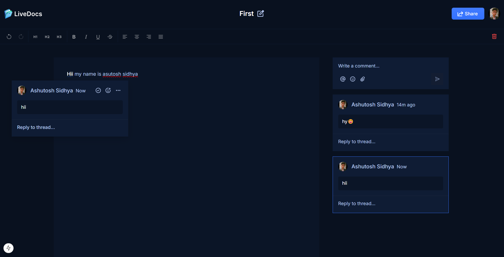
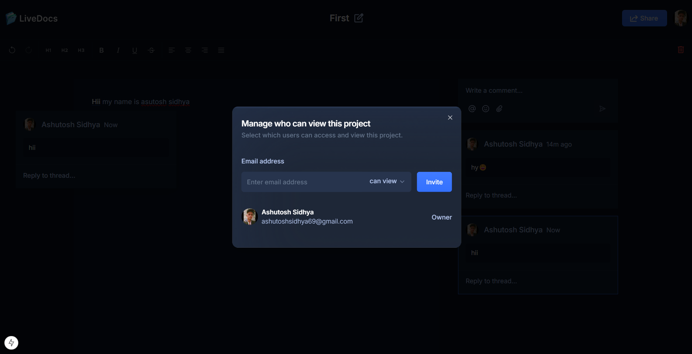
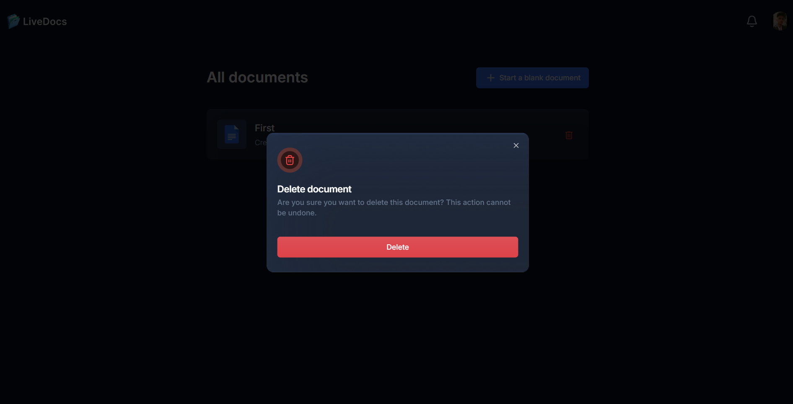
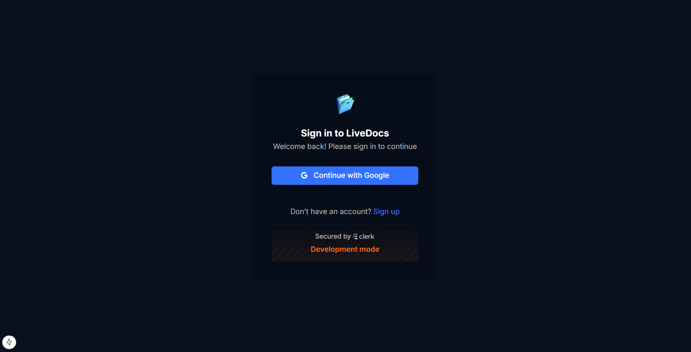
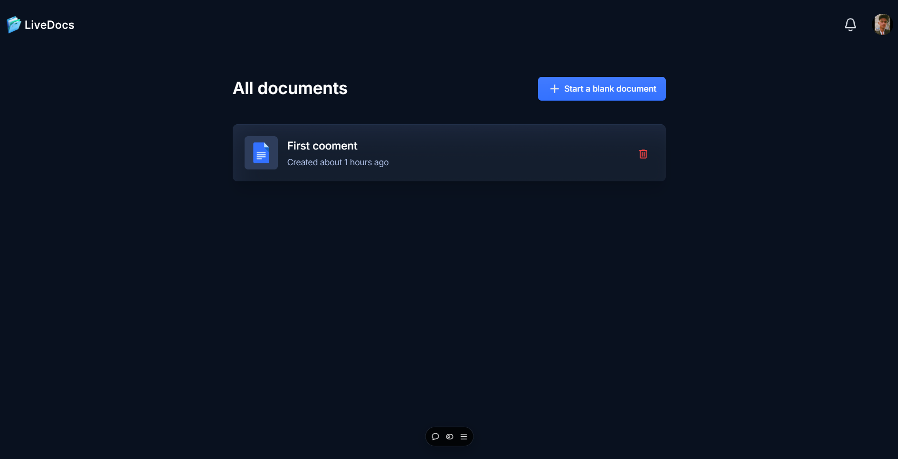

1. Init The NEXT Project
```bash
npx create-next-app@latest ./ --typescript --tailwind --eslint
```
2. Init The shadcn/ui in your existing Project
```bash
npx shadcn@latest init
```

publicApiKey={"pk_dev_XymPe-Hxa1tAmkGN0sr96EE0yCIJs1Fou-p50veWQaKaV8SuQgeaSu14DGZoH59N"}